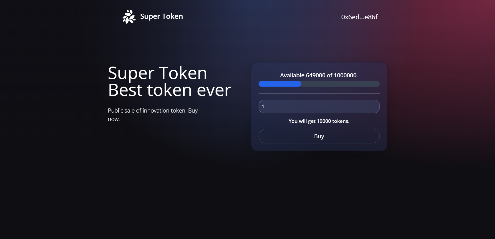

# Token Sale

## Technologies & Tools
- Vite
- React
- Tailwind CSS
- Solidity
- Web3.js
- Truffle
- Ganache

## Setting Up
1. Clone/Download.
2. Install dependencies using `npm install`.
3. Run local development blockchain with `npx ganache -d -a 15`.
4. Add custom ganache chain (RPC URL: `http://127.0.0.1:8545`, Chain ID: `1337`) and import development account to Metamask.
5. Migrate smart contract using `npx truffle migrate`.
6. `npx truffle test` to run tests.
7. Launch local server `npm run dev` and open [http://localhost:5173](http://localhost:5173) to view project in your browser.